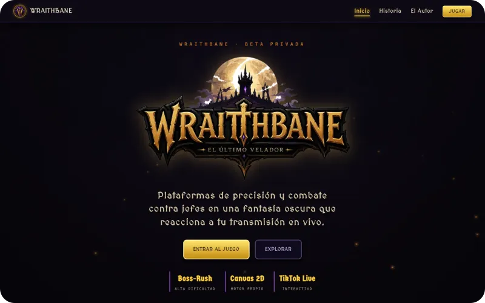

<a href="README.md">English</a> | <b>Español</b>

<a href="https://sam.wilkiedevs.com">
<picture>
  <source media="(prefers-color-scheme: dark)" srcset="assets/banner-dark-es.svg">
  <source media="(prefers-color-scheme: light)" srcset="assets/banner-light-es.svg">
  
</picture>
</a>

<picture>
  <source media="(prefers-color-scheme: dark)" srcset="assets/typing-dark-es.svg">
  <source media="(prefers-color-scheme: light)" srcset="assets/typing-light-es.svg">
  
</picture>

## `$ whoami`

<a href="https://sam.wilkiedevs.com">
<picture>
  <source media="(prefers-color-scheme: dark)" srcset="assets/hero-dark-es.svg">
  <source media="(prefers-color-scheme: light)" srcset="assets/hero-light-es.svg">
  
</picture>
</a>

Convierto problemas complejos en productos escalables, desde plataformas SaaS con IA hasta soluciones web para clientes en Latinoamérica, Norteamérica y más allá. Productos reales con usuarios reales, y también un videojuego creado junto a mi hijo.

## `$ ls ~/products`

### Productos de IA y SaaS

<table>
<tr>
<td width="50%" valign="top">
 
<b>Lookitry</b> 
Probador virtual con IA para tiendas de ropa, en beta abierta, con plugin de WooCommerce y una API. 
<code>TypeScript · React · PHP · WooCommerce API · modelos de imagen con IA</code>
</td>
<td width="50%" valign="top">
 
<b>Rendertry</b> 
Visualizador de personalización automotriz con IA: previsualiza rines, pintura y wraps sobre una foto real del vehículo. 
<code>TypeScript · React · API de generación de imágenes con IA</code>
</td>
</tr>
</table>

### Plataformas Empresariales

Sistemas privados construidos para empresas. El código es confidencial; cada showcase cubre la arquitectura y las decisiones de ingeniería.

<table>
<tr>
<td width="33%" valign="top">
 
<b>Nexus</b> 
Plataforma de operaciones clínicas y portal de pacientes Connect para OmniStem, sobre Microsoft Azure. 
<code>TypeScript · React · Node.js · Azure · PostgreSQL + pgvector</code>
</td>
<td width="33%" valign="top">
 
<b>Atlas</b> 
Plataforma de inventario clínico y trazabilidad de suministros para OmniStem. 
<code>TypeScript · React · Node.js · PostgreSQL (Prisma) · Microsoft 365 SSO</code>
</td>
<td width="33%" valign="top">
 
<b>GM Capital</b> 
Portal de evaluación de crédito con un agente de IA en WhatsApp integrado al CRM. 
<code>TypeScript · Python (MCP) · Kommo CRM · agente de IA en WhatsApp · n8n</code>
</td>
</tr>
</table>

### MCP y Herramientas para Desarrolladores

<table>
<tr>
<td width="50%" valign="top">
 
<b>kommo-kiro-power</b> 
Kiro Power y servidor MCP para gestionar Kommo CRM desde un IDE con IA. <a href="https://builder.aws.com/content/3FyW2H9qfOkF9J1PwXhtsGflN7z/building-a-kiro-power-for-kommo-crm-from-mcp-server-to-published-power">Lee el artículo en AWS Builder</a>. 
<code>Python · Model Context Protocol · Kiro Power · Kommo CRM</code>
</td>
<td width="50%" valign="top">
 
<b>Margarita Tank</b> 
Pantalla de escritorio para Claude Code sobre un ESP32-C6, con animación y consumo de tokens en vivo. Fork de Clawd Tank. 
<code>C · Python · ESP32-C6 · BLE · LVGL</code>
</td>
</tr>
</table>

### Respuesta a Emergencias (Código Abierto)

Construidos como respuesta a la emergencia en Cali, Colombia.

<table>
<tr>
<td width="50%" valign="top">
 
<b>ESPetral Rescue</b> 
Herramienta de código abierto para búsqueda y rescate en campo, con detección de movimiento por Wi-Fi CSI. 
<code>C (ESP-IDF) · TypeScript · React · Node.js · Wi-Fi CSI</code>
</td>
<td width="50%" valign="top">
 
<b>Grietas Vivas</b> 
PWA offline-first para la evaluación preliminar de grietas tras un sismo, creada para la emergencia de Cali. 
<code>TypeScript · React · Supabase · pgvector · Leaflet</code>
</td>
</tr>
</table>

### Proyecto en Familia

Construido junto a mi hijo de 11 años.

<table>
<tr>
<td width="50%" valign="top">
 
<b>Wraithbane</b> 
Un plataformero 2D de fantasía oscura, tipo boss-rush, creado por mi hijo Travis, donde las audiencias de TikTok Live y Kick influyen en la partida en tiempo real. Yo construí el puente con el streaming en vivo, el servidor de acceso con Patreon y telemetría, y el despliegue. 
<code>JavaScript · HTML5 Canvas · Node.js · Socket.IO · Supabase · Docker</code>
</td>
</tr>
</table>

## `$ ls ~/clients`

Proyectos reales entregados a negocios reales (11 proyectos)

| Proyecto | Descripción | Stack |
|---------|-------------|-------|
| [Wilkie Devs](https://wilkiedevs.com) | Estudio de desarrollo web con más de 50 proyectos en Colombia, Canadá y Costa Rica | PHP · WordPress |
| [Cube Media](https://cubemedia-jet.vercel.app/) | Sitio de una productora audiovisual, con contenido editable en Sanity CMS | TypeScript · React · Sanity CMS · next-intl · GSAP |
| [Grupo Metric](https://grupometric.co) | Sitio de portafolio de una firma de arquitectura y diseño de interiores | PHP · WordPress · Elementor |
| [Precision Wrapz](https://precisionwrapz.com) | Landing page premium para una empresa de wrapping vehicular en Canadá | PHP · WordPress |
| [LW Language School](https://lwlanguageschool.com) | Plataforma educativa LMS para una escuela de idiomas en Costa Rica | PHP · WordPress · LMS plugin |
| [Duques Tours](https://duquestours.co) | Plataforma web para una agencia de tours y turismo en Colombia | PHP · WordPress |
| [Life Kombucha](https://lifekombucha.co) | Tienda en línea y sitio de marca para una marca colombiana de kombucha | PHP · WordPress · WooCommerce · Elementor Pro · MailChimp |
| [Carrusel Beauty Academy](https://www.carrusel.edu.co) | Sitio institucional de una academia de belleza en Cali, con portales para estudiantes y servicios | PHP · WordPress · Elementor · Astra |
| [La Mariana](https://lamariana.com.co) | Sitio web de una casa vacacional de lujo en el Lago Calima, Colombia | PHP · WordPress · Elementor Pro |
| [La Montana Agromercados](https://lamontana.co) | Plataforma corporativa de un mercado agrícola colombiano | PHP · WordPress |
| [Caribe Supermercados](https://caribesupermercados.co) | Sitio corporativo de una cadena de supermercados colombiana, con SEO optimizado | PHP · WordPress |

## `$ cat tech-stack.yaml`

<picture>
  <source media="(prefers-color-scheme: dark)" srcset="assets/stack-dark.svg">
  <source media="(prefers-color-scheme: light)" srcset="assets/stack-light.svg">
  
</picture>

## `$ open --socials`

*Construyendo desde Cali, Colombia para el mundo.*

El código de este repositorio está bajo licencia <a href="LICENSE">MIT con atribución</a>: si lo usas, da crédito a <a href="https://github.com/depper-IA">depper-IA</a> en tu README. El contenido personal y los recursos gráficos tienen todos los derechos reservados.

