<a href="https://sam.wilkiedevs.com">
<picture>
  <source media="(prefers-color-scheme: dark)" srcset="assets/banner-dark.svg">
  <source media="(prefers-color-scheme: light)" srcset="assets/banner-light.svg">
  
</picture>
</a>

<picture>
  <source media="(prefers-color-scheme: dark)" srcset="assets/typing-dark.svg">
  <source media="(prefers-color-scheme: light)" srcset="assets/typing-light.svg">
  
</picture>

## `$ whoami`

<a href="https://sam.wilkiedevs.com">
<picture>
  <source media="(prefers-color-scheme: dark)" srcset="assets/hero-dark.svg">
  <source media="(prefers-color-scheme: light)" srcset="assets/hero-light.svg">
  
</picture>
</a>

Turning complex problems into scalable products, from AI-powered SaaS platforms to client-facing web solutions across Latin America, North America and beyond. Real products with real users.

## `$ ls ~/products`

### AI Products & SaaS

<table>
<tr>
<td width="50%" valign="top">
<a href="https://lookitry.com">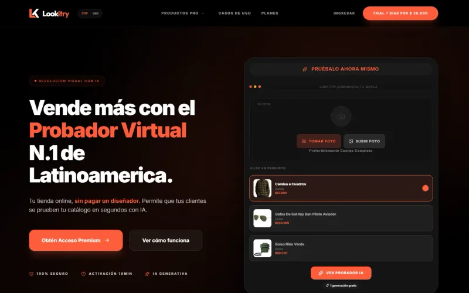</a> 
<b>Lookitry</b> 
AI virtual try-on for clothing stores, in open beta, with a WooCommerce plugin and an API. 
<code>TypeScript · React · PHP · WooCommerce API · AI image models</code>
</td>
<td width="50%" valign="top">
<a href="https://rendertry.com">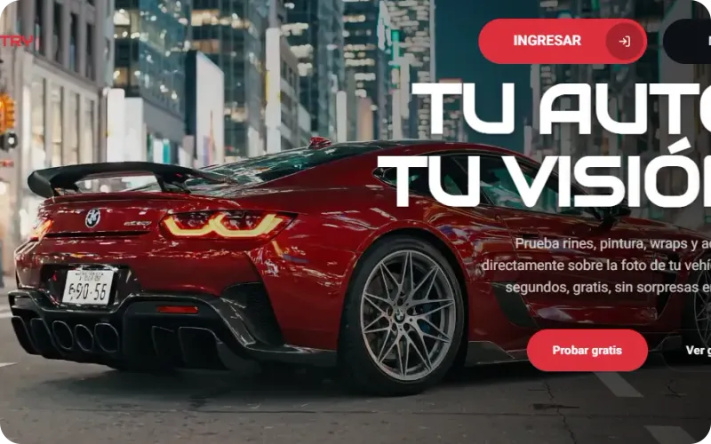</a> 
<b>Rendertry</b> 
AI automotive customization visualizer: preview rims, paint and wraps on a real photo of the vehicle. 
<code>TypeScript · React · AI image generation API</code>
</td>
</tr>
</table>

### Enterprise Platforms

Private systems built for companies. Code is confidential; each showcase covers architecture and engineering decisions.

<table>
<tr>
<td width="33%" valign="top">
<a href="https://github.com/depper-IA/nexus-showcase">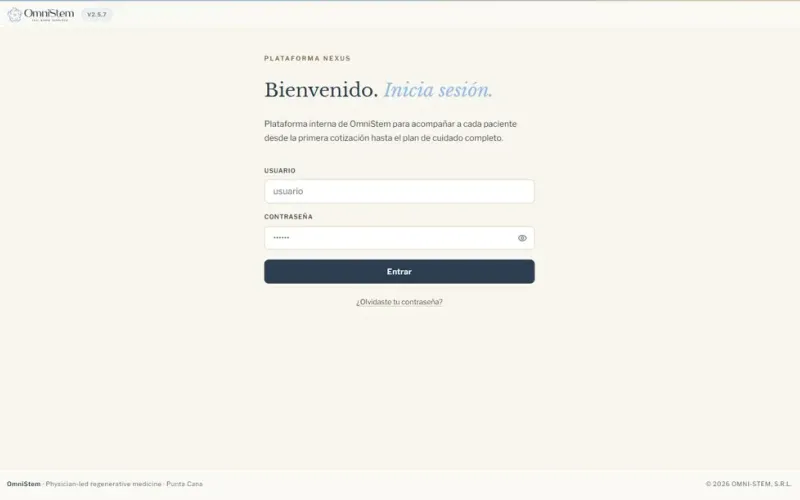</a> 
<b>Nexus</b> 
Clinical operations platform and Connect patient portal for OmniStem, on Microsoft Azure. 
<code>TypeScript · React · Node.js · Azure · PostgreSQL + pgvector</code>
</td>
<td width="33%" valign="top">
<a href="https://github.com/depper-IA/atlas-showcase">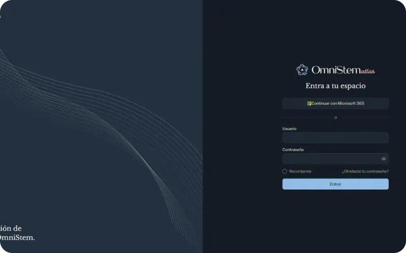</a> 
<b>Atlas</b> 
Clinical inventory and supply traceability platform for OmniStem. 
<code>TypeScript · React · Node.js · PostgreSQL (Prisma) · Microsoft 365 SSO</code>
</td>
<td width="33%" valign="top">
 
<b>GM Capital</b> 
Credit evaluation portal with a WhatsApp AI agent integrated into the CRM. 
<code>TypeScript · Python (MCP) · Kommo CRM · WhatsApp AI agent · n8n</code>
</td>
</tr>
</table>

### MCP & Dev Tooling

<table>
<tr>
<td width="50%" valign="top">
<a href="https://github.com/depper-IA/kommo-kiro-power">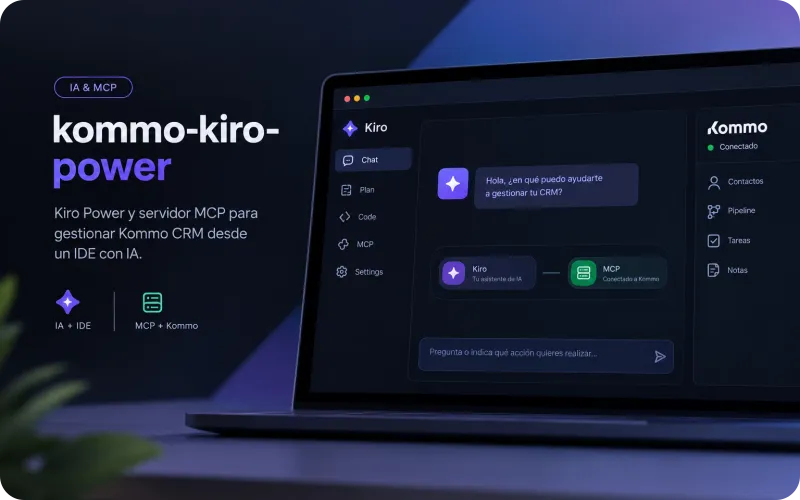</a> 
<b>kommo-kiro-power</b> 
Kiro Power and MCP server to manage Kommo CRM from an AI IDE. <a href="https://builder.aws.com/content/3FyW2H9qfOkF9J1PwXhtsGflN7z/building-a-kiro-power-for-kommo-crm-from-mcp-server-to-published-power">Read the article on AWS Builder</a>. 
<code>Python · Model Context Protocol · Kiro Power · Kommo CRM</code>
</td>
<td width="50%" valign="top">
<a href="https://github.com/depper-IA/margarita-tank">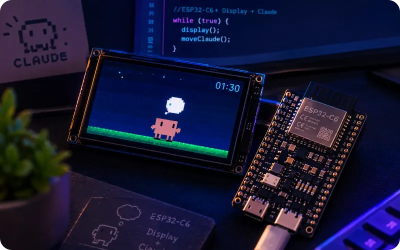</a> 
<b>Margarita Tank</b> 
Desktop display for Claude Code on an ESP32-C6 with animation and live token usage. Fork of Clawd Tank. 
<code>C · Python · ESP32-C6 · BLE · LVGL</code>
</td>
</tr>
</table>

### Emergency Response (Open Source)

Built in response to the emergency in Cali, Colombia.

<table>
<tr>
<td width="50%" valign="top">
<a href="https://github.com/depper-IA/ESPetral-Rescue">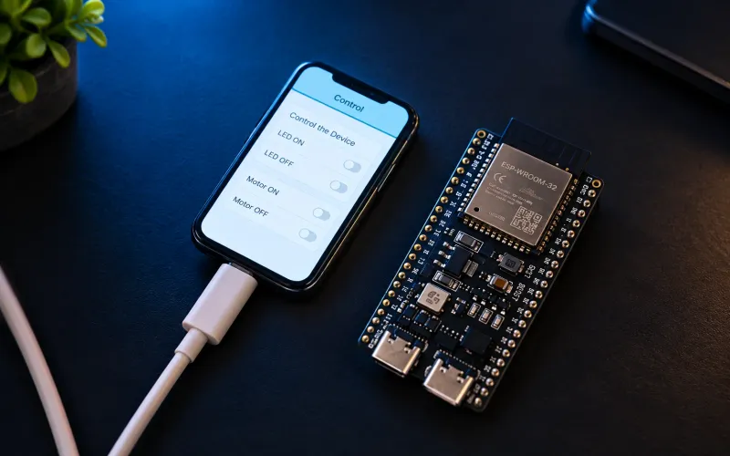</a> 
<b>ESPetral Rescue</b> 
Open-source field search-and-rescue tool with Wi-Fi CSI motion detection. 
<code>C (ESP-IDF) · TypeScript · React · Node.js · Wi-Fi CSI</code>
</td>
<td width="50%" valign="top">
<a href="https://grietas-vivas.vercel.app">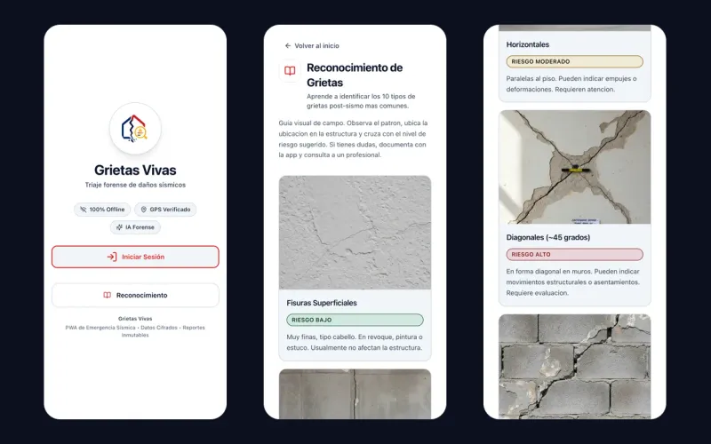</a> 
<b>Grietas Vivas</b> 
Offline-first PWA for preliminary crack triage after an earthquake, built for the Cali emergency. 
<code>TypeScript · React · Supabase · pgvector · Leaflet</code>
</td>
</tr>
</table>

## `$ ls ~/clients`

Real projects delivered for real businesses (11 projects)

| Project | Description | Stack |
|---------|-------------|-------|
| [Wilkie Devs](https://wilkiedevs.com) | Web development studio with 50+ projects in Colombia, Canada and Costa Rica | PHP · WordPress |
| [Cube Media](https://cubemedia-jet.vercel.app/) | Audiovisual production company site, content edited in Sanity CMS | TypeScript · React · Sanity CMS · next-intl · GSAP |
| [Grupo Metric](https://grupometric.co) | Architecture and interior design firm portfolio site | PHP · WordPress · Elementor |
| [Precision Wrapz](https://precisionwrapz.com) | Premium landing page for a vehicle wrapping company in Canada | PHP · WordPress |
| [LW Language School](https://lwlanguageschool.com) | LMS educational platform for a language school in Costa Rica | PHP · WordPress · LMS plugin |
| [Duques Tours](https://duquestours.co) | Web platform for a tour and tourism agency in Colombia | PHP · WordPress |
| [Life Kombucha](https://lifekombucha.co) | Online store and brand site for a Colombian kombucha brand | PHP · WordPress · WooCommerce · Elementor Pro · MailChimp |
| [Carrusel Beauty Academy](https://www.carrusel.edu.co) | Institutional site for a beauty academy in Cali, with student and service portals | PHP · WordPress · Elementor · Astra |
| [La Mariana](https://lamariana.com.co) | Website for a luxury vacation rental on Lago Calima, Colombia | PHP · WordPress · Elementor Pro |
| [La Montana Agromercados](https://lamontana.co) | Corporate platform for a Colombian agricultural market | PHP · WordPress |
| [Caribe Supermercados](https://caribesupermercados.co) | Corporate site for a Colombian supermarket chain with optimized SEO | PHP · WordPress |

## `$ cat tech-stack.yaml`

<picture>
  <source media="(prefers-color-scheme: dark)" srcset="assets/stack-dark.svg">
  <source media="(prefers-color-scheme: light)" srcset="assets/stack-light.svg">
  
</picture>

## `$ open --socials`

[![AWS Builder](https://img.shields.io/badge/AWS_Builder-@samwilkie-000000?style=flat-square&logo=data%3Aimage%2Fsvg%2Bxml%3Bbase64%2CPHN2ZyB2aWV3Qm94PSIwIDAgMTI4IDEyOCIgeG1sbnM9Imh0dHA6Ly93d3cudzMub3JnLzIwMDAvc3ZnIj4KCTxwYXRoIGQ9Ik0zNi4zNzkgNTMuNjRjMCAxLjU2LjE2OCAyLjgyNS40NjUgMy43NS4zMzYuOTI2Ljc1OCAxLjkzOCAxLjM0NyAzLjAzMi4yMDcuMzM2LjI5My42NzIuMjkzLjk2OSAwIC40MTgtLjI1NC44NC0uOCAxLjI2MWwtMi42NTMgMS43N2MtLjM3OS4yNS0uNzU4LjM3OS0xLjA5My4zNzktLjQyMiAwLS44NDQtLjIxMS0xLjI2Ni0uNTlhMTMuMjggMTMuMjggMCAwIDEtMS41MTYtMS45OCAzNC4xNTMgMzQuMTUzIDAgMCAxLTEuMzA0LTIuNDg1Yy0zLjI4MiAzLjg3NS03LjQxIDUuODEzLTEyLjM4IDUuODEzLTMuNTM1IDAtNi4zNTUtMS4wMTItOC40MjEtMy4wMzItMi4wNjMtMi4wMjMtMy4xMTQtNC43MTgtMy4xMTQtOC4wODYgMC0zLjU3OCAxLjI2Mi02LjQ4NCAzLjgzMy04LjY3MSAyLjU2Ni0yLjE5MiA1Ljk3Ni0zLjI4NiAxMC4zMTYtMy4yODYgMS40MyAwIDIuOTAyLjEyNSA0LjQ2LjMzNiAxLjU2LjIxMSAzLjE2MS41NDcgNC44NDUuOTI2di0zLjA3NGMwLTMuMi0uNjc2LTUuNDMtMS45OC02LjczNEMyNi4wNjEgMzIuNjMzIDIzLjc4OCAzMiAyMC41NDYgMzJjLTEuNDczIDAtMi45ODguMTY4LTQuNTQ3LjU0N2EzMy40MTYgMzMuNDE2IDAgMCAwLTQuNTQ3IDEuNDMzYy0uNjc2LjI5My0xLjE4LjQ2MS0xLjQ3My41NDctLjI5Ni4wODItLjUwNy4xMjUtLjY3NS4xMjUtLjU5IDAtLjg4My0uNDIyLS44ODMtMS4zMDR2LTIuMDYzYzAtLjY3Ni4wODItMS4xOC4yOTMtMS40NzYuMjEtLjI5My41OS0uNTg2IDEuMTgtLjg4MyAxLjQ3Mi0uNzU4IDMuMjQyLTEuMzkgNS4zMDQtMS44OTUgMi4wNjMtLjU0NyA0LjI1NC0uOCA2LjU3LS44IDUuMDA4IDAgOC42NzIgMS4xMzYgMTEuMDMyIDMuNDEgMi4zMTYgMi4yNzMgMy40OTIgNS43MjYgMy40OTIgMTAuMzU5djEzLjY0Wm0tMTcuMDk0IDYuNDAzYzEuMzg3IDAgMi44Mi0uMjU0IDQuMzM2LS43NTggMS41MTYtLjUwOCAyLjg2My0xLjQzMyA0LTIuNjk1LjY3Mi0uOCAxLjE4LTEuNjg0IDEuNDMtMi42OTUuMjU0LTEuMDEyLjQyMi0yLjIzLjQyMi0zLjY2NXYtMS43NjVhMzQuNDAxIDM0LjQwMSAwIDAgMC0zLjg3MS0uNzE5IDMxLjgxNiAzMS44MTYgMCAwIDAtMy45NjEtLjI1Yy0yLjgyIDAtNC44ODMuNTQ3LTYuMjc0IDEuNjg0LTEuMzg3IDEuMTM2LTIuMDYyIDIuNzM0LTIuMDYyIDQuODQgMCAxLjk4LjUwNCAzLjQ1MyAxLjU1OCA0LjQ2NCAxLjAxMiAxLjA1MSAyLjQ4NSAxLjU1OSA0LjQyMiAxLjU1OVptMzMuODA5IDQuNTQ3Yy0uNzU4IDAtMS4yNjItLjEyNS0xLjU5OC0uNDIyLS4zNC0uMjU0LS42MzMtLjg0LS44ODctMS42NEw0MC43MTUgMjkuOThjLS4yNS0uODQzLS4zOC0xLjM5LS4zOC0xLjY4NyAwLS42NzIuMzM3LTEuMDUgMS4wMTMtMS4wNWg0LjEyNWMuOCAwIDEuMzQ3LjEyNCAxLjY0NC40MjEuMzM2LjI1LjU5Ljg0Ljg0IDEuNjRsNy4wNzQgMjcuODc2IDYuNTctMjcuODc1Yy4yMDgtLjg0LjQ2Mi0xLjM5Ljc5Ny0xLjY0LjM0LS4yNTUuOTMtLjQyMyAxLjY4OC0uNDIzaDMuMzY3Yy44IDAgMS4zNDguMTI1IDEuNjg0LjQyMi4zMzYuMjUuNjMzLjg0LjggMS42NGw2LjY1MyAyOC4yMTIgNy4yODUtMjguMjExYy4yNS0uODQuNTQ3LTEuMzkuODQtMS42NC4zMzYtLjI1NS44ODctLjQyMyAxLjY0NC0uNDIzaDMuOTE0Yy42NzYgMCAxLjA1NS4zMzYgMS4wNTUgMS4wNTEgMCAuMjEtLjA0My40MjItLjA4Ni42NzYtLjA0My4yNTQtLjEyNS41OS0uMjkzIDEuMDVMODAuODAxIDYyLjU3Yy0uMjU0Ljg0LS41NDcgMS4zODctLjg4NyAxLjY0LS4zMzYuMjU1LS44ODMuNDIzLTEuNTk4LjQyM2gtMy42MmMtLjgwMSAwLTEuMzQ4LS4xMy0xLjY4NC0uNDIyLS4zNC0uMjk3LS42MzMtLjg0NC0uODAxLTEuNjg0bC02LjUyNy0yNy4xNi02LjQ4NSAyNy4xMTdjLS4yMS44NDQtLjQ2IDEuMzkxLS44IDEuNjg0LS4zMzcuMjk3LS45MjYuNDIyLTEuNjg0LjQyMlptNTQuMTA1IDEuMTM3Yy0yLjE4NyAwLTQuMzc5LS4yNTQtNi40ODQtLjc1OC0yLjEwNi0uNTA0LTMuNzQ2LTEuMDU1LTQuODQtMS42ODQtLjY3Ni0uMzc5LTEuMTM3LS44LTEuMzA1LTEuMThhMi45MTkgMi45MTkgMCAwIDEtLjI1NC0xLjE4di0yLjE0OGMwLS44ODIuMzM2LTEuMzA0Ljk3LTEuMzA0LjI1IDAgLjUwMy4wNDMuNzU3LjEyOS4yNS4wODIuNjI5LjI1IDEuMDUuNDE4YTIzLjEwMiAyMy4xMDIgMCAwIDAgNC42MzQgMS40NzZjMS42ODMuMzM2IDMuMzI0LjUwNCA1LjAxMS41MDQgMi42NTMgMCA0LjcxNS0uNDY1IDYuMTQ1LTEuMzkgMS40MzMtLjkyNiAyLjE5MS0yLjI3NCAyLjE5MS00IDAtMS4xOC0uMzc5LTIuMTQ1LTEuMTM2LTIuOTQ2LS43NTgtLjgtMi4xOTItMS41MTYtNC4yNTQtMi4xOTFsLTYuMTA2LTEuODk1Yy0zLjA3NC0uOTY5LTUuMzQ4LTIuMzk4LTYuNzM0LTQuMjkzLTEuMzktMS44NTUtMi4xMDYtMy45MTgtMi4xMDYtNi4xMDUgMC0xLjc3LjM4LTMuMzI4IDEuMTM3LTQuNjc2YTEwLjgyOSAxMC44MjkgMCAwIDEgMy4wMzEtMy40NTNjMS4yNjItLjk2NSAyLjY5Ni0xLjY4NCA0LjM4LTIuMTg4IDEuNjgzLS41MDQgMy40NTItLjcxNSA1LjMwNC0uNzE1LjkyNiAwIDEuODk0LjA0MyAyLjgyLjE2OC45NjkuMTI1IDEuODUyLjI5MyAyLjczOC40NjEuODQuMjExIDEuNjQxLjQyMiAyLjM5OS42NzYuNzU4LjI1NCAxLjM0OC41MDQgMS43Ny43NTguNTkuMzM2IDEuMDExLjY3MiAxLjI2MSAxLjA1LjI1NC4zNC4zNzkuODAyLjM3OSAxLjM5MXYxLjk4YzAgLjg4NC0uMzM2IDEuMzQ4LS45NjkgMS4zNDgtLjMzNiAwLS44ODMtLjE3MS0xLjU5Ny0uNTA3LTIuNDAzLTEuMDk0LTUuMDk4LTEuNjQxLTguMDg2LTEuNjQxLTIuMzk5IDAtNC4yOTMuMzc5LTUuNTk4IDEuMTgtMS4zMDkuNzk3LTEuOTggMi4wMi0xLjk4IDMuNzQ2IDAgMS4xOC40MjEgMi4xOTEgMS4yNjEgMi45ODguODQ0LjggMi40MDMgMS42MDIgNC42MzMgMi4zMTZsNS45OCAxLjg5NWMzLjAzMi45NjkgNS4yMiAyLjMxNiA2LjUyNCA0LjA0MyAxLjMwNSAxLjcyNyAxLjkzOCAzLjcwNyAxLjkzOCA1Ljg5NSAwIDEuODEyLS4zOCAzLjQ1My0xLjA5NCA0Ljg4Mi0uNzU4IDEuNDM0LTEuNzcgMi42OTYtMy4wNzQgMy43MDctMS4zMDUgMS4wNTEtMi44NjQgMS44MDktNC42NzIgMi4zNi0xLjg5NS41ODYtMy44NzUuODgzLTYuMDI0Ljg4M1ptMCAwIi8%2BCgk8cGF0aCBkPSJNMTE4IDczLjM0OGMtNC40MzIuMDYzLTkuNjY0IDEuMDUyLTEzLjYyMSAzLjgzMi0xLjIyMy44ODMtMS4wMTIgMi4wNjIuMzM2IDEuODk0IDQuNTA4LS41NDcgMTQuNDQtMS43MjYgMTYuMjEuNTQ3IDEuNzcgMi4yMy0xLjk3NiAxMS42Mi0zLjY2MyAxNS43OS0uNTA0IDEuMjYuNTkgMS43NjkgMS43MjYuOCA3LjQxLTYuMjMxIDkuMzQ4LTE5LjI0MiA3LjgzMi0yMS4xMzctLjc1Ny0uOTI1LTQuMzg4LTEuNzktOC44Mi0xLjcyNnpNMS42MyA3NS44NTljLS45MjcuMTE2LTEuMzQ3IDEuMjM2LS4zNjggMi4xMjEgMTYuNTA4IDE0LjkwMiAzOC4zNTkgMjMuODcyIDYyLjYxMyAyMy44NzIgMTcuMzA1IDAgMzcuNDMtNS40MyA1MS4yODEtMTUuNjYgMi4yNzMtMS42ODguMjk3LTQuMjU0LTIuMDItMy4yMDQtMTUuNTM0IDYuNTctMzIuNDIxIDkuNzctNDcuNzg4IDkuNzctMjIuNzc4IDAtNDQuOC02LjI3My02Mi42NTMtMTYuNjMzLS4zOS0uMjMxLS43NTUtLjMwNC0xLjA2NC0uMjY2eiIvPgo8L3N2Zz4%3D)](https://builder.aws.com/community/@samwilkie?tab=articles)

*Building from Cali, Colombia for the world.*

Code in this repo is licensed under <a href="LICENSE">MIT with attribution</a>: if you use it, credit <a href="https://github.com/depper-IA">depper-IA</a> in your README. Personal content and assets are all rights reserved.

